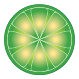

# LimeWire '08 — qBittorrent WebUI Alternative UI

<p align="center">
  
</p>

<p align="center">
  <strong>A recreation of the classic LimeWire 2008 desktop client</strong><br>
  wrapping a fully functional qBittorrent v5 WebUI.
</p>

<p align="center">
  
  
  
</p>

---

## What you get

A working qBittorrent WebUI that looks and feels like the 2008 LimeWire desktop app:

- **XP-Luna blue chrome** — glossy title bar with green LimeWire wordmark
- **Classic menu bar** — File · View · Navigation · Resources · Tools · Filters · Help
- **Search box** + toolbar buttons (Monitor, Connections, Library, New@Lime)
- **Gold filter panels** — Status (live), Media, Category
- **Skinned transfer list** — full qBittorrent functionality (add, start, stop, properties, trackers, peers, files, RSS, search, categories, tags, speed limits, log)
- **Control bar** — Clear / Resume / Pause / Clear Inactive
- **Status bar** — live speeds, peer count, LimeWire Media Player strip

All qBittorrent features work. The frame is purely cosmetic — no iframes, no cross-frame auth.

## Screenshot

| 2008 LimeWire | This UI |
|---|---|
| | 
 |

## Install

1. SFTP or clone this folder to your qBittorrent machine, e.g. `~/.config/qBittorrent/limewire-ui/`
2. In qBittorrent: **Tools → Options → Web UI**
   - Tick **☑ Alternative UI interface**
   - Point the path at the **`LimeWire-WebUI`** folder (the one containing `private/` and `public/`) — **not** `…/private`
3. **Save**, hard-refresh the WebUI (`Cmd/Ctrl+Shift+R`), log in

> **Why this layout?** qBittorrent serves `/` as `<root>/private/index.html` (logged in) and `<root>/public/index.html` (not logged in). It never serves a folder-root `index.html`. The logged-in page merges the LimeWire frame and qBittorrent's app into ONE DOM — no iframes, no duplicate menu bars.

## Folder structure

```
LimeWire-WebUI/
├─ README.md
├─ LICENSE
├─ .gitignore
├─ css/limewire-frame.css    ← frame chrome (title bar, menu, search, gold panels, status bar)
├─ scripts/limewire.js       ← live speeds + filter wiring
├─ images/                   ← green leaf logo + toolbar/filter icons
├─ public/                   ← LOGIN page (unauthenticated)
│   ├─ index.html
│   ├─ css/login.css
│   ├─ scripts/login.js
│   └─ images/
└─ private/                  ← LOGGED-IN app (frame + qBittorrent merged)
    ├─ index.html            ← THE main page
    ├─ css/                  ← limewire.css skin + 8 stock qBittorrent stylesheets
    ├─ images/               ← 86 stock icons + limewire.png
    ├─ scripts/              ← MooTools, MochaUI, dynamicTable, …
    └─ views/                ← qBittorrent view partials
```

## Honest limits

These are decorative (qBittorrent's WebUI has no API for them):

- **Search box** — no global file-search API in the WebUI (work in progress)
- **Media / Category panels** — no such breakdown in the WebUI (Status panel IS live)
- **Media Player strip** — LimeWire nostalgia
- **Frame buttons** (Monitor/Connections/…)

Live values (speeds, peer count) populate from the WebAPI once logged in.

## Customize

| What | Where |
|---|---|
| Frame colors / layout | `css/limewire-frame.css` |
| Transfer list skin | top `:root` block in `private/css/limewire.css` |
| Toolbar buttons | `private/index.html` (search for `toolbar`) |
| Filter wiring | `scripts/limewire.js` |

## Credits

- **qBittorrent** — [github.com/qbittorrent/qBittorrent](https://github.com/qbittorrent/qBittorrent)
- **MochaUI** — the windowing framework qBittorrent uses for dialogs
- **LimeWire 4.18.3** (2008) — the design inspiration

## License

MIT — see [LICENSE](LICENSE).
